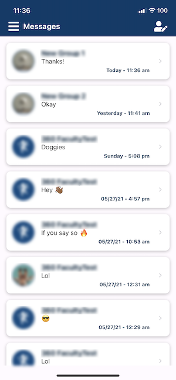
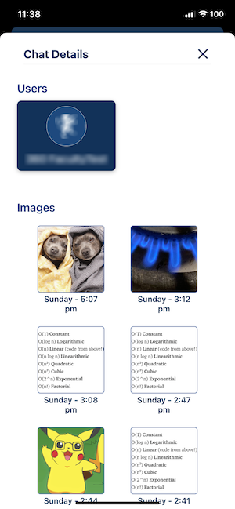
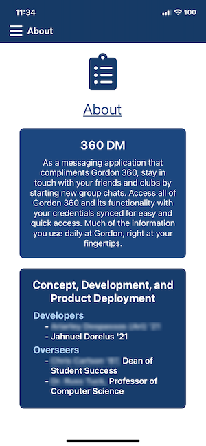
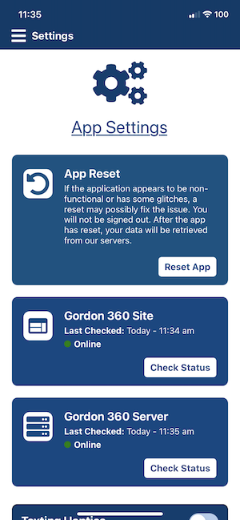
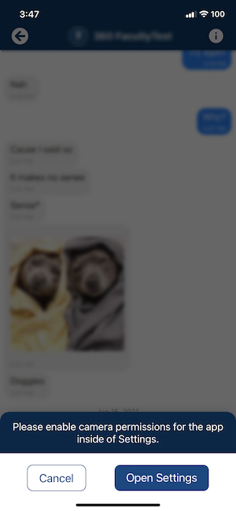

<p>
  <!-- iOS -->
  
  <!-- Android -->
  
</p>

## 👷&nbsp;&nbsp;&nbsp;Purpose

- Chris Carlson who’s our customer is the Dean of Student Success. He oversees operations and resources that would promote a student’s involvement and success while attending Gordon College. While there are many information-based Gordon websites currently accessible to students, it's a known fact that a student's primary resource for information is their smartphone. Mobile apps power our daily lives. Gordon 360 is one of Gordon’s web platforms that was made by students, for students. It's a central place for students to view personal information, join new clubs, and find activities throughout campus. Our goal is to use this platform to allow students and faculty to connect as we've become more socially distant due to Covid-19. As Gordon 360's environment exists solely on the web, there are many limitations put into place for mobile devices. We intend to create a mobile application that would help individuals stay in touch while incorporating Gordon 360's current web ecosystem.

## 📜&nbsp;&nbsp;&nbsp;Design Document

- https://docs.google.com/document/d/19ZKxjMTd3x-V4B5TIUYO3TishPf5Bvb245_4jhe7xGs/edit?usp=sharing

<br/>

## 📜&nbsp;&nbsp;&nbsp;User Stories

- https://drive.google.com/file/d/192zBSbFHV8dkPMFZv7GNuCI4L0jPgu6s/view?usp=sharing

<br/>

## 📜&nbsp;&nbsp;&nbsp;Tools Proposal

- https://docs.google.com/document/d/11XzF7SbY94uw0OCi_q1oCgfPXNCJib9uiFnjfBa6mM4/edit?usp=sharing

<br/>

## 👥&nbsp;&nbsp;&nbsp;Lofi User Study

- https://drive.google.com/file/d/12QNG491fKHFfJucT3vYGnumR7fiu1lyG/view?usp=sharing

<br/>

## 📱&nbsp;&nbsp;&nbsp;Adobe XD Sketch

- https://xd.adobe.com/view/73f200d1-a075-4d62-9ddf-e2480d14bb2d-26a1/

<br/>

## 🤔&nbsp;&nbsp;&nbsp;Problem Statement

- https://docs.google.com/presentation/d/1KAvq2Z2kaWoHd6xHDp5utLFS6qgmR5O2uCL2YME8aqc/edit?usp=sharing

<br/>

## &nbsp;&nbsp;&nbsp;Final Presentation Slides

- https://docs.google.com/presentation/d/1Y_X6unoZz11H5mlaSbJKe4WA6ddGGzveeY4cRbUIoYk/edit?usp=sharing

<br/>

## 💿&nbsp;&nbsp;&nbsp;API - How the back-end is setup

- https://github.com/gordon-cs/gordon-360-api

<br/>

## &nbsp;&nbsp;&nbsp;Redux

- This application uses Redux alongside React to manage the state. You can learn more about redux <a href="https://redux.js.org/tutorials/fundamentals/part-1-overview">here<a/>.
- Some actions that are used with Redux is from Redux's Toolkit. You can learn more about these actions <a href="https://redux-toolkit.js.org/introduction/getting-started#whats-included">here</a>.
- You can debug the application through Redux using React Native Debugger. You can find the instructions on how to install it on your machine <a href="https://medium.com/@tetsuyahasegawa/how-to-integrate-react-native-debugger-to-your-expo-react-native-project-db1d631fad02">here</a>. Skip steps 4 and 5 as they have already been completed in the application. Make sure to install all dependencies below as a few of them are required for Redux and React Native Debugger to work. After following the steps, you will be able to debug the application using the Redux and React Dev Tools that come along with it. When connecting the application to the React Native Debugger, you must make sure that you are using the correct port number. The default is "19001". However, if you see a new tab open up in your browser instead of connecting to React Native Debugger, make sure to look at the port number of the tab's URL. In the example of, "http://localhost:19000/debugger-ui/", we can see that the debug port number is "19000". Therefore, we must open a new window in React Native Debugger and set the port number as "19000". After doing so, reload the application and it should connected to React Native Debugger successfully.

<br/>

## &nbsp;&nbsp;&nbsp;Expo Push Notification Service

- Push Notification Tool:
  - https://expo.io/notifications
- Sending Notifications with Expo's Push API:
  - https://docs.expo.io/push-notifications/sending-notifications/#push-tickets
- Expo Notifications (JS API):
  - https://docs.expo.io/versions/latest/sdk/notifications/#types
- Push Notifications Overview:
  - https://docs.expo.io/push-notifications/overview/

<br/>

## &nbsp;&nbsp;&nbsp;Building the App with Expo

- Building the app:
  - https://docs.expo.io/distribution/building-standalone-apps/
- What you should make sure of before distributing the app
  - https://docs.expo.io/distribution/app-stores/
    <br/>

### Make sure to follow these steps exactly or else you may run into random bugs and glitches! To upgrade Expo, you must have "expo" as a command. That command should be available if you have `expo-cli` installed.

- Update Expo's CLI using the command, '`npm install expo-cli`' if using NPM and, '`yarn add expo-cli`' if using Yarn.
- After the CLI finishes installing, MAKE SURE to upgrade Expo. Not doing so can lead to hours and hours of debugging and not finding the answers to why a bug or glitch is occuring. This is due to Expo's upgraded CLI not finding the correct dependencies it needs to run correctly. If you have changes in your project and haven't pushed it yet to Github, it's best to stash it before upgrading Expo. This can be done with the command, '`git stash`'. Afterward, you can upgrade Expo with the command, '`expo upgrade`'. After everything installs correctly, the project manifest files such as '<i>package.json</i>' will have updated. You have upgraded Expo successfully! If you stashed changes before running '`expo upgrade`', continue reading below to recover your changes successfully. Otherwise, you are all set! 🎉
- Due to git seeing the modified files such as '<i>package.json</i>' as "changes", you will be required to run the command '`git stash`' again. Your stack should be similar to the example below. You may view your stack with the command, '`git stash list`'.

---

| Stash #   | What's Contained in the Stash                                                                  |
| --------- | ---------------------------------------------------------------------------------------------- |
| stash@{0} | The modified files after executing the command, '`expo upgrade`' (aka yarn.lock, package.json) |
| stash@{1} | The modified files before executing the command, '`expo upgrade`'                              |
| stash@{x} | Other stashes you may have had in the stack before from other coding sessions.                 |

---

- To successfully recover your files, first recover the files you made changes to before upgrading Expo. This can be done with the command, '`git stash pop stash@{1}`'. Now, commit these files with the command, '`git add .`'. You have to commit the files first because git won't allow you to recover your files from a stash in your stack unless you commit the changes. After commiting the changes, now execute the command, '`git stash pop`'. This will recover the files that changed after upgrading Expo. Lastly, to bring all changes together, run the command, '`git add .`' once more. It's recommended to push your changes to your branch immediately so that if an unclear error occurs while coding, you can checkout all the files without having to re-upgrade Expo. If you're not in a branch that you wanted to push the changes to, or wanted to create a new branch, you can uncommit your changes with the command, '`git reset head`' and continue on doing so.

<br/><br/>

## 💻&nbsp;&nbsp;&nbsp;How to Use

1. First install Yarn or NPM with `yarn` or `npm install`. It's HIGHLY recommended to use Yarn rather than NPM due to NPM giving off many warnings about not being able to link different packages. The amount of warnings from installing with Yarn is substantially smaller than installing with NPM. Yarn links packages better than NPM.

   - To install all dependencies in one command, use any of the following commands. If using npm, make sure to run `npm audit fix` after installation.

     - `npm i --save expo-cli react-native-webview react-native-elements react-native-vector-icons @react-navigation/stack react-native-gifted-chat react-native-gesture-handler @react-native-community/async-storage bluebird react-native-offline reselect @reduxjs/toolkit redux redux-devtools-extension moment react-error-boundary react-native-exception-handler && expo install expo-linear-gradient @react-native-community/netinfo expo-image-picker expo-haptics expo-file-system sentry-expo`
     - `yarn add expo-cli react-native-webview react-native-elements react-native-vector-icons @react-navigation/stack react-native-gifted-chat react-native-gesture-handler @react-native-community/async-storage bluebird react-native-offline reselect @reduxjs/toolkit redux redux-devtools-extension moment react-error-boundary react-native-exception-handler && expo install expo-linear-gradient @react-native-community/netinfo expo-image-picker expo-haptics expo-file-system sentry-expo`

   - To install dependencies separately, use any of the following commands. If using npm, make sure to run `npm audit fix` after installation.
     - Install Expo using any of the following commands.
       - `npm i expo-cli`
       - `yarn add expo-cli`
     - Install WebView using any of the following commands.
       - `npm i react-native-webview`
       - `yarn add react-native-webview`
     - Install React Native Elements using any of the following commands.
       - `npm i react-native-elements`
       - `yarn add react-native-elements`
     - Install React Native Vector Icons using any of the following commands.
       - `npm i react-native-vector-icons`
       - `yarn add react-native-vector-icons`
     - Install React Native Stack Navigation using any of the following commands.
       - `npm i @react-navigation/stack`
       - `yarn add @react-navigation/stack`
     - Install GiftedChat using any of the following commands.
       - `npm i react-native-gifted-chat`
       - `yarn add react-native-gifted-chat`
     - Install React Native Gesture Handler using any of the following commands.
       - `npm i react-native-gesture-handler`
       - `yarn add react-native-gesture-handler`
     - Install React Native AsyncStorage using any of the following commands.
       - `npm i @react-native-community/async-storage`
       - `yarn add @react-native-community/async-storage`
     - Install Bluebird using any of the following commands.
       - `npm i bluebird`
       - `yarn add bluebird`
     - Install React Native Offline using any of the following commands.
       - `npm i react-native-offline`
       - `yarn add react-native-offline`
     - Install Reselect using any of the following commands.
       - `npm i reselect`
       - `yarn add reselect`
     - Install Redux using any of the following commands.
       - `npm i redux`
       - `yarn add redux`
     - Install Redux Toolkit using any of the following commands.
       - `npm i @reduxjs/toolkit`
       - `yarn add @reduxjs/toolkit`
     - Install Redux Dev Tools Extension using any of the following commands.
       - `npm i redux-devtools-extension`
       - `yarn add redux-devtools-extension`
     - Install Moment (Used for Date) using any of the following commands.
       - `npm i moment`
       - `yarn add moment`
     - Install React Error Boundary using any of the following commands.
       - `npm i react-error-boundary`
       - `yarn add react-error-boundary`
     - Install React Native Exception Handler using any of the following commands.
       - `npm i react-native-exception-handler`
       - `yarn add react-native-exception-handler`
     - Install Expo Linear Gradient using the following command.
       - `expo install expo-linear-gradient`
     - Install NetInfo using the following command.
       - `expo install @react-native-community/netinfo`
     - Install Expo Image Picker using the following command.
       - `expo install expo-image-picker`
     - Install Expo Haptics using the following command.
       - `expo install expo-haptics`
     - Install Expo File System using the following command.
       - `expo install expo-file-system`
     - Install Expo Sentry using the following command.
       - `expo install sentry-expo`
     - Install Expo Screen Orientation using the following command.
       - `expo install expo-screen-orientation`

2. You can open your application using any of the following commands depending on your preference.
   - Start the server only:
     - `expo start`
   - Start the server and open application in Android simulator (Android Studio must be installed).
     - `expo start --android`
   - Start the server and open application in iOS simulator (Only for Mac and Xcode must be installed).
     - `expo start --ios`

<br/><br/>

## 🐛&nbsp;⚠️&nbsp;&nbsp;&nbsp;Known Bugs and Warnings

<table>
  <!-------------------------------------------------- # 1 -------------------------------------------------->
  <tr align="left" valign="top" style="border-bottom: 1px solid grey">
    <td style="color: #FFE266"> 
      1
    </td>
    <td style="color: #FFE266"> 
    NO CODE REFERENCE
    </td>
    <td style="color: #FC9186"> 
      This is a BIG WARNING when updating Expo's CLI. If you update Expo's CLI using `npm -g install expo-cli` or `yarn add expo-cli `, this can cause serious glitches with the app as the CLI has updated but the rest of Expo's dependencies hasn't. Even if the glitches may not happen right away, you may experience things such as random network requests going missing. LITERALLY. You would invoke a network request and you will never get a response back. You won't get an error either to indicate that the network request timed out. 
    </td>
    <td style="color: #82C9FF"> 
    In order to prevent glitches from happening, make sure to upgrade Expo after upgrading the CLI by following the guide above.
    </td>
    <td style="color: #FFE266">
    </td>
  </tr>
</table>

## 🏭&nbsp;&nbsp;&nbsp;Data Structures

1. Structure of the Room Object. All rooms are arranged together in a list.

```javascript
  Object {
    _id: String | Number,
    name: String | null,
    group: Boolean,
    createdAt: Date,
    lastUpdated: Date,
    roomImage: "Not Available - Image type to be determined",
    users: [
      {
        _id: Number,
        name: String,
        avatar: "Not Available - Image type to be determined",
      },
    ],
  };
```

- <strong>\_id:</strong> The ID of the room. <br />
- <strong>name:</strong> The name of the room. If the room is not a group, then no room name is available. <br/>
- <strong>group:</strong> Determines if a room is group. A room is a group if the room has more than 1 user (apart from the main user). <br/>
- <strong>createdAt:</strong> Determines the date the room was created. Format is in Coordinated Universal Time (UTC). <br/>
- <strong>lastUpdated:</strong> Determines the date the room was last updated. In other words, the date and time of the last text made in the room. Format is in Coordinated Universal Time. <br/>
- <strong>roomImage:</strong> The image of the room. <br/>
- <strong>users:</strong> A list of all users in the chat. <br/>

  <br/>

2. Structure of the Message Object. All messages are arranged together in a list.

```javascript
  Object {
    _id: String | Number,
    text: String,
    createdAt: Date | Number,
    user: {
      _id: Number,
      name: String,
      avatar: "Not Available - Image type to be determined",
    },
    image: "Not Available - Image type to be determined",
    video: "Not Available - Video type to be determined",
    audio: "Not Available - Audio type to be determined",
    system: Boolean,
    sent: Boolean,
    received: Boolean,
    pending: Boolean,
    quickReplies: {
      type: "radio" | "checkbox",
      values: [
        {
          title: String,
          value: String,
          messageId: String | Number,
        },
      ],
      keepIt: Boolean,
    },
  };
```

- <strong>\_id:</strong> The ID of the message. <br />
- <strong>text:</strong> The text of the message. <br/>
- <strong>createdAt:</strong> Determines the date the room was created. Format is in Coordinated Universal Time (UTC). <br/>
- <strong>user:</strong> The user who sent the text message. <br/>
- <strong>image:</strong> Source of an image file. <br/>
- <strong>video:</strong> Source of a video file. <br/>
- <strong>audio:</strong> Source of an audio file. <br/>
- <strong>system:</strong> Determines if the message is from the system or a user. <br/>
- <strong>sent:</strong> Determines if the message has been sent. In other words, received by the server. <br/>
- <strong>received:</strong> Determines if the user received the message. Only available for non-group rooms. <br/>
- <strong>pending:</strong> Determines if a message hasn't been received by the server from device submisssion. <br/>
- <strong>quickReplies:</strong> A quick reply message. <br/>
  - <strong>type:</strong> Either a radio or checkbox. In other words, a user can either choose one message (radio) or multiple messages which are combined together as one (checkbox) for their response. <br/>
  - <strong>values:</strong> A list of quick replies messages available <br/>
    - <strong>title:</strong> The text of the quick reply message <br/>
    - <strong>value:</strong> The value of the quick reply message <br/>
    - <strong>messageId:</strong> The ID of the quick reply message <br/>
  - <strong>keepIt:</strong> Not known - To be determined. <br/>

<br/><br/>

## &nbsp;📱&nbsp;&nbsp;&nbsp;App Screenshots

<table>
  <tr>
    <th>Screen Name</th>
    <th>Description</th>
    <th>Image</th>
  </tr>
  <!-- Login -->
  <tr style="text-align:center;">
    <td>Login</td>
    <td>Where a user logs in using their Gordon account. </td>
    <td>
      
    </td>
  </tr>
  <!-- Gordon 360 -->
  <tr style="text-align:center;">
    <td>Gordon 360</td>
    <td>Where a user can access Gordon 360 as its web environment is integrated into the app. </td>
    <td>
      
    </td>
  </tr>
  <!-- Rooms -->
  <tr style="text-align:center;">
    <td>Rooms</td>
    <td>Where a user can access all of the chats they are a part of. </td>
    <td>
      
    </td>
  </tr>
  <!-- Chat -->
  <tr style="text-align:center;">
    <td>Chat</td>
    <td>Where a user can conversate with others in a chat. </td>
    <td>
      
    </td>
  </tr>
  <!-- Chat Details -->
  <tr style="text-align:center;">
    <td>Chat Details</td>
    <td>Where a user can view the images and the other users in a chat. </td>
    <td>
      
    </td>
  </tr>
  <!-- New Chat Search -->
  <tr style="text-align:center;">
    <td>Create New Chat Search</td>
    <td>Where a user can search and select others in the Gordon community to start a new chat. </td>
    <td style="display:flex; flex-direction: row;">
      
       
       
    </td>
  </tr>
  <!-- New Chat Room Creator -->
  <tr style="text-align:center;">
    <td>Create New Chat Room </td>
    <td>Where a user can add a chat room image and send the chat's first text message. 
        They may also add a custom chat name if the chat is a group. </td>
    <td>
      
    </td>
  </tr>
  <!-- About -->
  <tr style="text-align:center;">
    <td>About</td>
    <td>Where a user can see the app's description and the teams that engineered and developed the application. </td>
    <td>
      
    </td>
  </tr>
  <!-- Profile -->
  <tr style="text-align:center;">
    <td>Profile</td>
    <td>Where a user can view their personal information. </td>
    <td>
      
    </td>
  </tr>
  <!-- Settings -->
  <tr style="text-align:center;">
    <td>Settings</td>
    <td>Where a user can make changes to the application such as signing out. </td>
    <td>
      
    </td>
  </tr>
  <!-- Image Viewer -->
  <tr style="text-align:center;">
    <td>Image Viewer</td>
    <td>Where a user can view an image and share it. </td>
    <td>
      
    </td>
  </tr>
  <!-- Camera Permissions -->
  <tr style="text-align:center;">
    <td>Camera Permissions</td>
    <td>Where a user can give the app camera permissions. </td>
    <td>
      
    </td>
  </tr>
</table>
